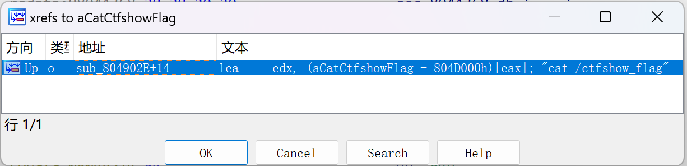

```
tasike@tasike-VM:~/Desktop$ chmod 777 pwn51
```

```
tasike@tasike-VM:~/Desktop$ file pwn51
pwn51: ELF 32-bit LSB executable, Intel 80386, version 1 (SYSV), dynamically linked, interpreter /lib/ld-linux.so.2, for GNU/Linux 3.2.0, BuildID[sha1]=948891884c9b0d405b050ac809c06cbb25e49774, stripped
```

```
tasike@tasike-VM:~/Desktop$ checksec pwn51
[*] '/home/tasike/Desktop/pwn51'
    Arch:     i386-32-little
    RELRO:    Partial RELRO
    Stack:    No canary found
    NX:       NX enabled
    PIE:      No PIE (0x8048000)
```

`32bit`，堆栈不可执行

`ida`查看

```c
int __cdecl main(int a1)
{
  sub_80492E6(&a1);
  sub_8049343();
  alarm(0x1Eu);
  sub_8049059();
  return 0;
}
```

发现符号表被扣了，那只能一个一个跟进了：
跟进`sub_80492E6`

```c
int sub_80492E6()
{
  setvbuf(stdout, 0, 2, 0);
  setvbuf(stdin, 0, 2, 0);
  return setvbuf(stderr, 0, 2, 0);
}
```

很显然是`init`函数，为了便于分析，鼠标点击`sub_80492E6`，再按`N`，从而修改函数名

同时发现下面几个函数都可以看出应该是什么函数，全部修改后：

```c
int __cdecl main()
{
  init();
  logo();
  alarm(0x1Eu);
  ctfshow();
  return 0;
}
```

这样好分析多了

跟进`ctfshow`

```c
int ctfshow()
{
  int v0; // eax
  int v1; // eax
  unsigned int v2; // eax
  int v3; // eax
  const char *v4; // eax
  int v6; // [esp-Ch] [ebp-84h]
  int v7; // [esp-Ch] [ebp-84h]
  int v8; // [esp-8h] [ebp-80h]
  int v9; // [esp-8h] [ebp-80h]
  char v10[12]; // [esp+0h] [ebp-78h] BYREF
  char s[32]; // [esp+Ch] [ebp-6Ch] BYREF
  char v12[24]; // [esp+2Ch] [ebp-4Ch] BYREF
  char v13[24]; // [esp+44h] [ebp-34h] BYREF
  unsigned int i; // [esp+5Ch] [ebp-1Ch]

  memset(s, 0, sizeof(s));
  puts("Who are you?");
  read(0, s, 0x20u);
  std::string::operator=(&unk_804D0A0, &unk_804A350);
  std::string::operator+=(&unk_804D0A0, s);
  std::string::basic_string((int)v12, (int)&unk_804D0B8);
  std::string::basic_string((int)v13, (int)&unk_804D0A0);
  sub_8048F06((int)v10, (int)v13, (int)v12);
  std::string::~string((int)v13, v6, v8);
  std::string::~string((int)v12, v7, v9);
  if ( sub_80496D6(v10) > 1u )
  {
    std::string::operator=(&unk_804D0A0, &unk_804A350);
    v0 = sub_8049700(v10, 0);
    if ( (unsigned __int8)sub_8049722(v0, &unk_804A350) )
    {
      v1 = sub_8049700(v10, 0);
      std::string::operator+=(&unk_804D0A0, v1);
    }
    for ( i = 1; ; ++i )
    {
      v2 = sub_80496D6(v10);
      if ( v2 <= i )
        break;
      std::string::operator+=(&unk_804D0A0, "IronMan");
      v3 = sub_8049700(v10, i);
      std::string::operator+=(&unk_804D0A0, v3);
    }
  }
  v4 = (const char *)std::string::c_str(&unk_804D0A0);
  strcpy(s, v4);
  printf("Wow!you are:%s", s);
  return sub_8049616(v10);
}
```

18行到20行，先对`s`置0，再读入`0x20`个字节刚好填满`s`。

21行

```
std::string::operator=(&unk_804D0A0, &unk_804A350);
把unk_804A350的内容复制到unk_804D0A0,点进unk_804A350发现它是0
```

22行

```
std::string::operator+=(&unk_804D0A0, s);
将s的内容追加到unk_804D0A0
```

23行

```
std::string::basic_string((int)v12, (int)&unk_804D0B8);

```


可以发现有`system`函数

查看一下字符串(`Fn + Shift + F12`)，会发现有`cat /ctfshow_flag`

**查看交叉引用**：双击该字符串，进入`IDA View-A`窗口，单击该字符串，`ctrl + x`即可查看交叉引用



跟进`sub_804902E`

```c
int sub_804902E()
{
  return system("cat /ctfshow_flag");
}
```

修改函数名：
```c
int getflag()
{
  return system("cat /ctfshow_flag");
}
```

